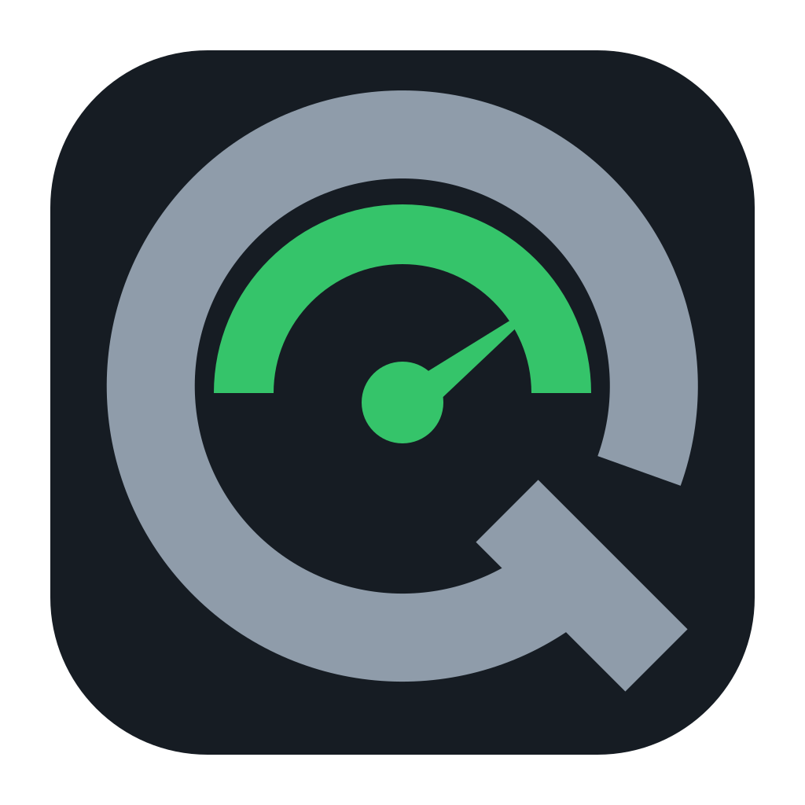
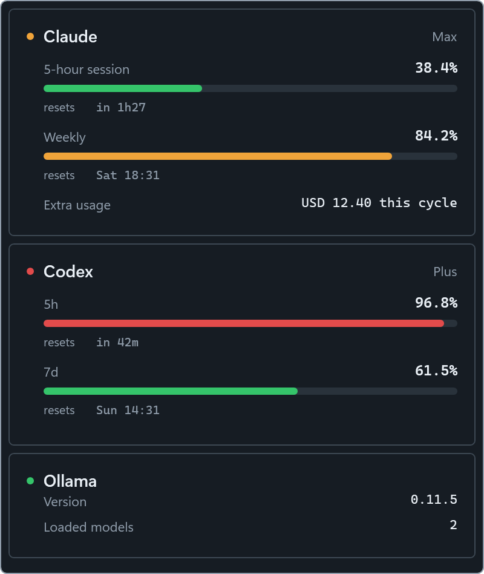

<p align="center">
  
</p>

<h1 align="center">QuotaGlass</h1>

QuotaGlass is a Windows tray application that shows Claude, Codex, OpenCode Go,
and Ollama status at a glance. It displays current usage windows in a tray
popup, can keep an optional overlay above other windows, and raises
notifications when usage crosses configured thresholds.



*Overlay shown with mocked provider data.*

## Features

- Claude, Codex, and OpenCode Go subscription usage windows
- Local Ollama version and running-model status
- Tray status based on the most urgent provider state
- Optional movable, always-on-top overlay
- Configurable warning and critical thresholds
- Global `Ctrl+Alt+A` overlay shortcut
- Optional start with Windows

## Requirements

- Windows 10 version 2004 or newer on x64
- [.NET 10 Desktop Runtime](https://dotnet.microsoft.com/download/dotnet/10.0)
- Claude Code, Codex CLI, and/or OpenCode Go already authenticated for their
  respective cards
- Ollama running locally for the Ollama card

QuotaGlass reads only the required credential fields from files created by
Claude Code, Codex CLI, and OpenCode. It does not write those files, refresh
tokens, or log credentials, account identifiers, or API response bodies.
Providers can be disabled in the local settings file.

## Build

Install the [.NET 10 SDK](https://dotnet.microsoft.com/download/dotnet/10.0),
then run:

```powershell
dotnet restore QuotaGlass.slnx
dotnet build QuotaGlass.slnx -c Release --no-restore
dotnet test QuotaGlass.slnx -c Release --no-build
dotnet publish src/QuotaGlass/QuotaGlass.csproj -c Release -p:PublishProfile=win-x64
```

The publish profile produces a framework-dependent, single-file
`QuotaGlass.exe` for Windows x64.

## Releases

Versions, changelog entries, and Windows release artifacts are managed through
Release Please. See [docs/release-process.md](docs/release-process.md) for the
Conventional Commit rules, approval flow, repository settings, and recovery
procedure.

## Configuration

QuotaGlass creates `%APPDATA%\QuotaGlass\settings.json` on first launch. The
defaults poll once per minute while active, use 80 and 95 percent warning
thresholds, keep the overlay hidden, and leave autostart disabled.

Runtime logs are written to `%APPDATA%\QuotaGlass\log.txt`. Logs contain status
categories only, not exception messages, headers, bodies, tokens, account IDs,
or email addresses.

## Security

Do not include credentials, account identifiers, or live API responses in bug
reports. See [SECURITY.md](SECURITY.md) for private vulnerability reporting.

## License

QuotaGlass is available under the [MIT License](LICENSE).
